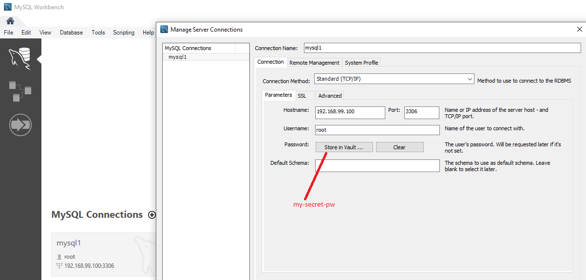
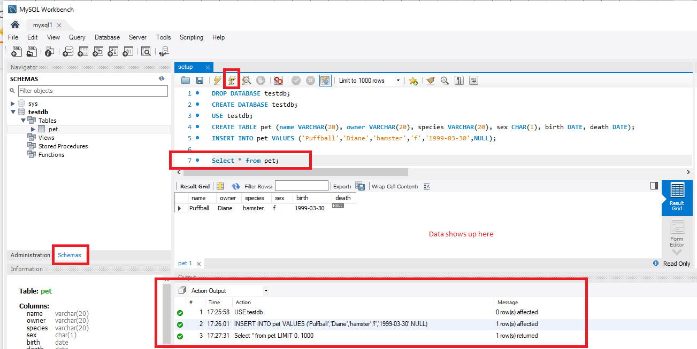

# Setup for MySQL Workbench and MySQL 8.0 running in Docker

Getting MySQL Workbench connected to MySQL 8.0 running in a Docker container can get complicated if you run into `connection not permitted` problems.

I have provided steps and some npm scripts in package.json to make things simpler.

The default `container name` and `password` used by my scripts are: `dom-mysql` and `my-secret-pwd` .

Feel free to adjust these values before running the commands.

## Get mysql docker image

```sh
npm run get-mysql-image
```

## List images

```sh
npm run list-images
```

outputs:

```sh
REPOSITORY TAG IMAGE ID CREATED SIZE
mysql/mysql-server latest 8a3a24ad33be 2 months ago 366MB
```

## Create a docker container based on the image, and set root password

```sh
npm run create-mysql-container
```

outputs a UUID for the container:

```sh
191508fcbcfd3b683fea06bb3c8a2f1f252527a15891b58b124518cf2cb60249
```

This also starts the container. You do this specific command ONCE. If you need to
stop and start the container afterwards, use : `npm run stop-container` and `npm run start-container`.

## View the status of your docker container on your machine

```sh
npm run list-containers

OR

npm run list-all-containers
```

The first lists running containers, and the second lists ALL containers (running and stopped).

output depends on the state of the container:

starting:

```sh
CONTAINER ID IMAGE COMMAND CREATED STATUS PORTS NAMES
191508fcbcfd mysql/mysql-server "/entrypoint.sh mysq…" About a minute ago Up About a minute (health: starting) 3306/tcp, 33060/tcp dom-mysql
```

started:

```sh
CONTAINER ID        IMAGE                COMMAND                  CREATED             STATUS                   PORTS                               NAMES
24505c80a83d        mysql/mysql-server   "/entrypoint.sh mysq…"   7 minutes ago       Up 7 minutes (healthy)   0.0.0.0:3306->3306/tcp, 33060/tcp   dom-mysql
```

## Opening a prompt into the mysql container

If you need to open a prompt into the container

```sh
npm run open-prompt
```

## Open the mysql interactive shell prompt into the container

Later on in this article, you will need to run some mysql commands.
This is how you open up the mysql interactive prompt.

```sh
npm run open-mysql-prompt
```

You will need to specify the password `my-secret-pw`.

You will be given the `mysql>` interactive prompt.

Enter valid [mysql commands](#mysql-commands)

Type `exit` to quit.

## Connecting MySQL Workbench to MySQL docker container on Windows 10

This is the hardest part. I had to figure out WHY the mysql workbench could NOT connect to
the mysql docker container on Windows 10.

Here are the steps for successfully setting up a connection.

### Figure out the IP address of the container

```sh
npm run show-docker-machine-ip
```

output:

```sh
192.168.99.100
```

### Figure out the port

The port is 3306.

You can see this value when you do `npm run list-containers` .

```sh
CONTAINER ID        IMAGE                COMMAND                  CREATED             STATUS                    PORTS                               NAMES
24505c80a83d        mysql/mysql-server   "/entrypoint.sh mysq…"   20 minutes ago      Up 20 minutes (healthy)   0.0.0.0:3306->3306/tcp, 33060/tcp   dom-mysql
```

### Fixing the root user info in the database

Knowing the IP address and port should be sufficient for MySQL Workbench to connect to the database in the MySQL docker container, but it isn't.

Your MySQL Workbench will have problems connecting to 192.168.99.100:3306.

It won't be allowed.

#### Modifying /etc/my.cnf

You need to change the default /etc/my.cnf that is provided in the docker container.

There is no editor on the docker container, so we will need to use a special command to copy our `my.cnf` on our hard drive to `/etc/my.cnf`
inside the container.

```sh
npm run copy-cnf
```

The important setting we are adding is:

```
bind-address=0.0.0.0
```

See [my.cnf](./my.cnf).

#### Fix the settings for root user

You need to delete the root user's definition, and create the root user again with different definition

```sh
npm run open-mysql-prompt
```

This opens the `mysql` interactive prompt.
You will be prompted for the password. Enter `my-secret-pw`.

Perform the following commands:

```sh
show databases;
use mysql;
SELECT user,host FROM user; // you can see the user definitions. There should be root@localhost .
drop user 'root'@'localhost';
CREATE USER 'root'@'%' IDENTIFIED BY 'my-secret-pw';
GRANT ALL PRIVILEGES ON *.* TO 'root'@'%' WITH GRANT OPTION;
ALTER USER 'root'@'%' IDENTIFIED WITH mysql_native_password BY 'my-secret-pw';
FLUSH PRIVILEGES;
```

Type `exit` to get out of the interactive shell

The `mysql_native_password` step above is to change the new/default [sha2](https://dev.mysql.com/doc/refman/8.0/en/caching-sha2-pluggable-authentication.html) authentication method in MySQL 8.0 back to the old [native](https://dev.mysql.com/doc/refman/8.0/en/native-pluggable-authentication.html) authentication method favoured by programmers who uses prior versions of MySQL.

Now stop and start the container.

```sh
npm run stop-container
npm run start-container
```

Check the logs of the container to see if everything is ok.

```sh
npm run show-logs
```

output:

```sh
[Entrypoint] MySQL Docker Image 8.0.21-1.1.17
[Entrypoint] Initializing database
2020-10-10T20:08:22.809376Z 0 [System] [MY-013169] [Server] /usr/sbin/mysqld (mysqld 8.0.21) initializing of server in progress as process 20
2020-10-10T20:08:22.823401Z 1 [System] [MY-013576] [InnoDB] InnoDB initialization has started.
2020-10-10T20:08:39.810201Z 1 [System] [MY-013577] [InnoDB] InnoDB initialization has ended.
2020-10-10T20:09:12.821296Z 6 [Warning] [MY-010453] [Server] root@localhost is created with an empty password ! Please consider switching off the --initialize-insecure option.
[Entrypoint] Database initialized
2020-10-10T20:10:23.747797Z 0 [System] [MY-010116] [Server] /usr/sbin/mysqld (mysqld 8.0.21) starting as process 81
2020-10-10T20:10:24.523215Z 1 [System] [MY-013576] [InnoDB] InnoDB initialization has started.
2020-10-10T20:10:26.282045Z 1 [System] [MY-013577] [InnoDB] InnoDB initialization has ended.
2020-10-10T20:10:27.294389Z 0 [System] [MY-011323] [Server] X Plugin ready for connections. Socket: /var/run/mysqld/mysqlx.sock
2020-10-10T20:10:28.316478Z 0 [Warning] [MY-010068] [Server] CA certificate ca.pem is self signed.
2020-10-10T20:10:28.317986Z 0 [System] [MY-013602] [Server] Channel mysql_main configured to support TLS. Encrypted connections are now supported for this channel.
2020-10-10T20:10:28.436967Z 0 [System] [MY-010931] [Server] /usr/sbin/mysqld: ready for connections. Version: '8.0.21'  socket: '/var/lib/mysql/mysql.sock'  port: 0  MySQL Community Server - GPL.
Warning: Unable to load '/usr/share/zoneinfo/iso3166.tab' as time zone. Skipping it.
Warning: Unable to load '/usr/share/zoneinfo/leapseconds' as time zone. Skipping it.
Warning: Unable to load '/usr/share/zoneinfo/tzdata.zi' as time zone. Skipping it.
Warning: Unable to load '/usr/share/zoneinfo/zone.tab' as time zone. Skipping it.
Warning: Unable to load '/usr/share/zoneinfo/zone1970.tab' as time zone. Skipping it.

[Entrypoint] ignoring /docker-entrypoint-initdb.d/*

2020-10-10T20:10:35.615148Z 10 [System] [MY-013172] [Server] Received SHUTDOWN from user root. Shutting down mysqld (Version: 8.0.21).
2020-10-10T20:11:10.605086Z 0 [System] [MY-010910] [Server] /usr/sbin/mysqld: Shutdown complete (mysqld 8.0.21)  MySQL Community Server - GPL.
[Entrypoint] Server shut down

[Entrypoint] MySQL init process done. Ready for start up.

[Entrypoint] Starting MySQL 8.0.21-1.1.17
2020-10-10T20:11:11.060362Z 0 [System] [MY-010116] [Server] /usr/sbin/mysqld (mysqld 8.0.21) starting as process 151
2020-10-10T20:11:11.515963Z 1 [System] [MY-013576] [InnoDB] InnoDB initialization has started.
2020-10-10T20:11:14.533342Z 1 [System] [MY-013577] [InnoDB] InnoDB initialization has ended.
2020-10-10T20:11:14.833765Z 0 [System] [MY-011323] [Server] X Plugin ready for connections. Bind-address: '::' port: 33060, socket: /var/run/mysqld/mysqlx.sock
2020-10-10T20:11:15.385223Z 0 [Warning] [MY-010068] [Server] CA certificate ca.pem is self signed.
2020-10-10T20:11:15.385694Z 0 [System] [MY-013602] [Server] Channel mysql_main configured to support TLS. Encrypted connections are now supported for this channel.
2020-10-10T20:11:15.482368Z 0 [System] [MY-010931] [Server] /usr/sbin/mysqld: ready for connections. Version: '8.0.21'  socket: '/var/lib/mysql/mysql.sock'  port: 3306  MySQL Community Server
- GPL.
[Entrypoint] MySQL Docker Image 8.0.21-1.1.17
[Entrypoint] Starting MySQL 8.0.21-1.1.17
2020-10-10T20:47:36.825667Z 0 [System] [MY-010116] [Server] /usr/sbin/mysqld (mysqld 8.0.21) starting as process 22
2020-10-10T20:47:36.871574Z 1 [System] [MY-013576] [InnoDB] InnoDB initialization has started.
2020-10-10T20:47:38.685523Z 1 [System] [MY-013577] [InnoDB] InnoDB initialization has ended.
2020-10-10T20:47:38.954109Z 0 [System] [MY-011323] [Server] X Plugin ready for connections. Bind-address: '::' port: 33060, socket: /var/run/mysqld/mysqlx.sock
2020-10-10T20:47:39.109335Z 0 [System] [MY-010229] [Server] Starting XA crash recovery...
2020-10-10T20:47:39.121060Z 0 [System] [MY-010232] [Server] XA crash recovery finished.
2020-10-10T20:47:40.488010Z 0 [Warning] [MY-010068] [Server] CA certificate ca.pem is self signed.
2020-10-10T20:47:40.488446Z 0 [System] [MY-013602] [Server] Channel mysql_main configured to support TLS. Encrypted connections are now supported for this channel.
2020-10-10T20:47:40.663988Z 0 [System] [MY-010931] [Server] /usr/sbin/mysqld: ready for connections. Version: '8.0.21'  socket: '/var/lib/mysql/mysql.sock'  port: 3306  MySQL Community Server
- GPL.
```

Looks like everything is OK.

Now, MySQL workbench should be able to connect to mysql running in the dom-mysql docker container.



### Creating database and tables in MySQL Workbench

You can open an SQL script file, like [setup.sql](./setup.sql), and run each command one line at a time to set up what you want.



## MySQL commands

Here are some useful articles for entering MySQL commands

- [MySQL SQL Commands](https://www.mysqltutorial.org/mysql-administration.aspx)
- [Using MySQL Workbench](https://dev.mysql.com/doc/workbench/en/wb-sql-editor-navigator.html)
- [General SQL](https://www.w3schools.com/sql/default.asp)

## References

Here are some articles I used to figure out the proper strategy in the [Fix the settings for root user](#fix-the-settings-for-root-user) section.


- [How to connect remote access on MySQL Server via MySQL Workbench?](https://www.digitalocean.com/community/questions/how-to-connect-remote-access-on-mysql-server-via-mysql-workbench)
- [Configuring database connection results in Error: Host 'xxxxxxx' is not allowed to connect to this MySQL server](https://confluence.atlassian.com/jirakb/configuring-database-connection-results-in-error-host-xxxxxxx-is-not-allowed-to-connect-to-this-mysql-server-358908249.html)
- [How to grant all privileges to root user in MySQL 8.0](https://stackoverflow.com/questions/50177216/how-to-grant-all-privileges-to-root-user-in-mysql-8-0/50197630)


They all discuss fixing this problem, but use syntax that apply to older versions of MySQL.

e.g.

```sh
GRANT ALL ON *.* to 'root@%' IDENTIFIED BY 'my-secret-pw';
```


[MySQL 8 removes shorthand for creating user + permissions](https://ma.ttias.be/mysql-8-removes-shorthand-creating-user-permissions/) discusses the new syntax for doing this in MySQL 8.0.

e.g.

```sh
drop user 'root'@'localhost';
CREATE USER 'root'@'%' IDENTIFIED BY 'my-secret-pw';
GRANT ALL PRIVILEGES ON *.* TO 'root'@'%' WITH GRANT OPTION;
```

